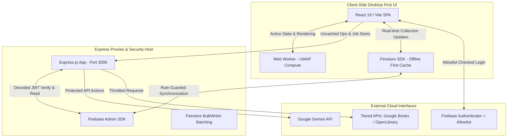
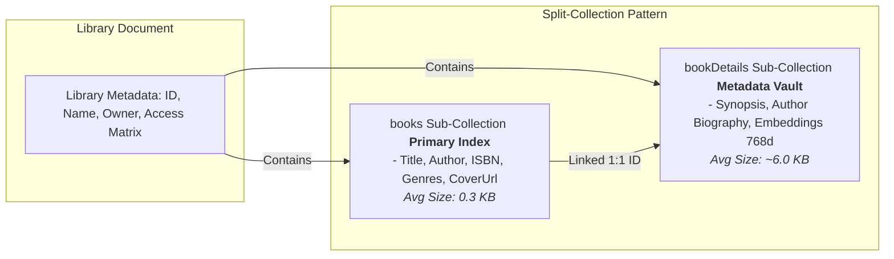
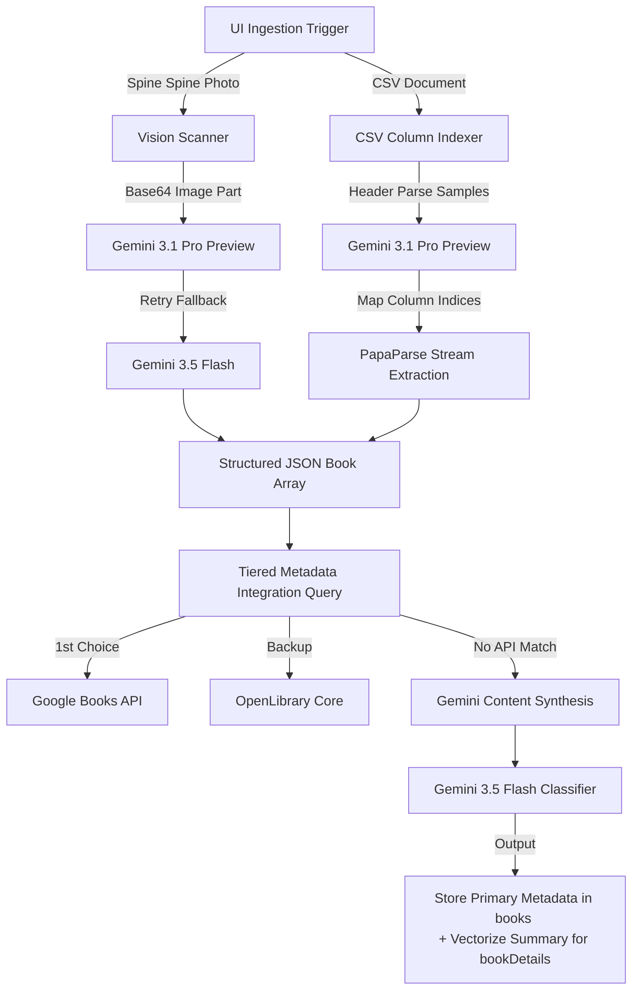
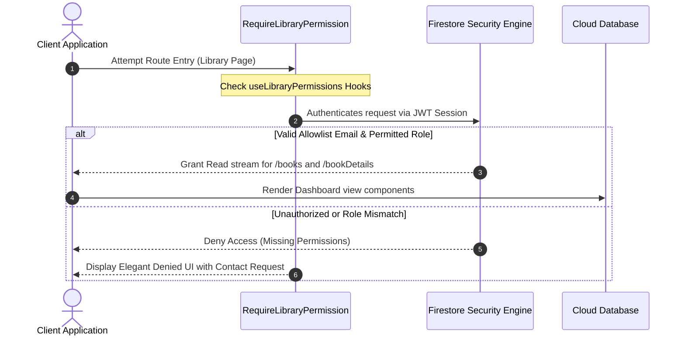

# Design Document: Bibliophile Hub (V4.0)

## Executive Summary
Bibliophile Hub is a high-performance, secure, and visually cohesive library management and semantic discovery platform. By pairing a high-fidelity React 19 single-page application (SPA) with a resilient Express.js proxy backend, the system delivers lightning-fast rendering (60FPS scrolling) alongside state-of-the-art multimodal AI integrations.

Leveraging the **Google Gemini SDK**, Bibliophile Hub converts flat metadata catalogs into an interactive thematic knowledge graph—providing physical/digital file scanners, CSV structure analyzers, UMAP-based spatial visualization, automatic series discovery, BISAC categorization, and personalized companion features. It is built upon a secure, offline-ready Firestore architecture.

---

## 1. System Architecture

The application adopts a full-stack hybrid topology that combines rich, responsive browser capabilities with server-side proxy controls.



### 1.1 Multi-Tier Execution Model
1. **Frontend Layer (React 19 + Tailwind CSS + Vite)**: 
   - Uses **Animate Presence (`motion`)** for smooth, declarative transitions.
   - Leverages Web Workers to offload memory-heavy multi-dimensional calculations (UMAP projections) from the main browser thread.
   - Displays real-time database changes utilizing Firestore's persistent offline sync layer.
2. **Backend Services (Express.js + Firebase Admin SDK)**:
   - Hosted on port `3000` via our Node process to perform safe atomic database operations.
   - Enforces administrative checks, handles clean library destruction (nested subcollections), updates library permission models, and manages bulk sync worker records.
3. **Secure Secrets Proxy (`/api/gemini/action`)**:
   - To robustly secure sensitive API keys, the browser never speaks directly to third-party endpoints. Instead, client-side hooks forward action envelopes to backend routes, validating current Firebase user session ID tokens (JWTs) before initializing the **Google GenAI SDK** using secure, server-side environment variables (`GEMINI_API_KEY`).

---

## 2. Split-Collection Data Blueprint

To minimize Time to First Paint (TTFP) and reduce network egress overhead on large collections, the platform decouples UI-responsive navigation items from heavy semantic payloads.



### 2.1 Collection Demarcation
- **Primary Index (`libraries/{id}/books`)**:
  Contains short, lightweight properties strictly required for high-speed ledger list renders and filtering. Removing large text blocks ensures mobile and ultra-wide grid views load instantly.
- **Metadata Vault (`libraries/{id}/bookDetails`)**:
  Acts as a lazy-loaded repository storing high-payload attributes, detailed text passages, 1:1 author profiles, and 768-dimensional float arrays (`gemini-embedding-2-preview`) utilized in spatial math projects.
- **Spruce Up Engine (Data Healing & Normalization)**:
  An embedded automation system that migrates legacy systems (where syonpses and author bios were directly in the `books` document) by moving them to the `bookDetails` container—cleaning the primary collection.

---

## 3. Advanced AI Orchestration Pipelines

Bibliophile Hub combines structural models into a powerful, multi-model generative intelligence pipeline.



### 3.1 Multimodal Spine Scanning & Book Extraction
- High-resolution photographs of library bookshelves are processed through `gemini-3.1-pro-preview` using native JSON-schema structures to guarantee strict array outputs (`{ title, author, isbn }`).
- A built-in race timeout of 30 seconds gracefully falls back to `gemini-3.5-flash` to handle high-traffic or regional rate limitations without crashing the parent layout.

### 3.2 Dynamic CSV Columns Mapping
- Complex, custom CSV files are mapped on the fly. The pipeline parses the initial three text rows via `PapaParse` and consults `gemini-3.1-pro-preview` to detect user column indices—mapping arbitrary column names (e.g. "Author/Creator", "Title Name", "Hardcover/EPUB") into systematic JSON keys (`title`, `author`, `isbn`, `format`) dynamically.

### 3.3 Semantic Constellation Engine
1. **Embeddings Collection**: Core book summaries are mapped into high-dimensional space utilizing `gemini-embedding-2-preview`.
2. **Worker Isolation**: The multi-dimensional arrays are sent to a dedicated client-side **Web Worker (UMAP Projection Tool)**, preventing the UI main-thread from blocking.
3. **Clustering & Intelligent Group Labels**: Points are categorized using automated K-Means math. To label clusters meaningfully (such as *"Stardust Fantasy"*), the titles of the 15 closest books in each group are forwarded to `gemini-3.5-flash` to generate poetic, contextual cluster titles.

### 3.4 Interactive Companion Helpers
- **Spoiler-Driven Plot Catchups**: `gemini-3.1-pro-preview` synthesizes structured, spoiler-rich act breakdowns for returning readers.
- **Similar Recommendations**: Calculates surrounding thematic vectors to suggest 5 relevant companion books based on library history.
- **AI Artistry**: Draws watercolor, Ghibli-inspired 16:9 scenic background canvas banners using `gemini-2.5-flash-image` (Imagen) from the user's custom library name.

---

## 4. Security & Access Enforcements

Enforced through strict server-side credentials and client-side page route protections.



### 4.1 Strict Google Authentication & App Allowlists
- System access requires explicit verification against a global allowlist collection located in the Firestore DB (`appSettings/allowlist/users`).
- **First-Run Bootstrapper**: In clean environments with empty allowlists, the first signing user is automatically registered as the administrative controller of the account.

### 4.2 Unified Loading Protection Route
- Previous versions suffered from split asynchronous checks, creating visible layout shifts and double loader indicators. The platform now implements a unified permission guard:
```typescript
// Enforced in src/components/RequireLibraryPermission.tsx
// Blocks mounting child layouts until access, user credentials, 
// and roles are fully determined behind a single, elegant loading state.
```

### 4.3 Database Integrity Rules
- Deeply nested subcollection checks in `firestore.rules` verify document relationships: ensuring a child book document can only be edited or updated if its parent library exists and the authenticated actor corresponds to the authorized roles array.

---

## 5. Implementation Decisions & Tradeoffs

```
  ┌───────────────────────────────────────────────────────────────┐
  │                        Design Choices                         │
  ├────────────────────────────────┬──────────────────────────────┤
  │ Model Preference               │ Multimodal Native: Gemini Pro│
  │ Offline Sync Mode              │ Firestore Core Persistence   │
  │ Graphical Engine               │ Recharts Declarative SVG     │
  └────────────────────────────────┴──────────────────────────────┘
```

- **Gemini over OpenAI**: Selected for its generous context window and native multi-model vision accuracy. Shelf scans contain highly complex visual perspectives (angles, lighting, fonts) that require spatial reasoners.
- **Local Persistence**: Relying on Firestore local cache offline mechanics provides instant index loads and offline reading capability inside remote or signal-dead archival rooms.
- **Recharts for Constellation**: Choosing `recharts` allows highly extensible, performant React implementations while leveraging Web Worker math computations to keep frames fluid.

---

## 6. Development Milestones
- [x] **Relational Schema Isolation**: Divide primary attributes from heavy vectors.
- [x] **Unified Loader UX**: Implement a clean `<PageLoading />` wrapper across Permission Checks and Library views to completely eliminate double loading indicators.
- [x] **Image & CSV Ingestion Engine**: Launch fast text scanners and schema mapping.
- [ ] **Physical/Digital Live Scan**: Integrate real-time camera scanning for ISBN recognition.
- [ ] **Public View Mode**: Create read-only, non-authenticated public gallery URLs for collectors to display their archives.
