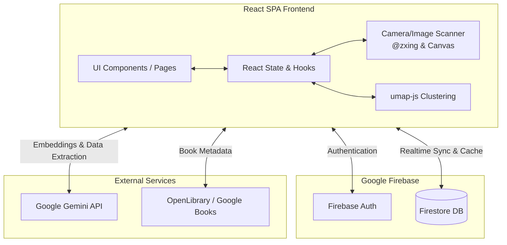

# Design Document: React Library & Book Tracking App

## Overview
The Library & Book Tracking App is a comprehensive digital system designed for readers, bibliophiles, and collectors to catalog both their physical and digital bookshelves. Built as a Single Page Application (SPA), it goes beyond simple record-keeping by employing modern AI to intelligently enhance and analyze user data. Users can ingest books via barcode scanning, taking a picture of an entire physical bookshelf, or querying traditional book APIs. Once in the system, AI is used to backfill missing metadata, generate semantic embeddings for each book, and visually cluster the user's library into a spatial "Constellation Map."

## System Architecture Diagram



## Core Components & Capabilities

### 1. Library Dashboard & Book Management
The entry point provides an overview of all user libraries, which can be shared or private. Internally, the application leans heavily on localized component state and context providers to manage UI state, rather than weighty globals like Redux.

### 2. Intelligent Ingestion Mechanisms
Instead of just manual entry, users can input books through:
- **Barcode Scanning**: Client-side parsing of video feeds.
- **Spine/Bookshelf Scanning**: Taking a photo of a shelf and prompting an LLM to extract book titles and authors from the image.
- **Bulk CSV Import**: Drag-and-drop parsing of existing GoodReads CSVs.

### 3. "Spruce Up" Metadata Enrichment
Often, imported or scanned books lack complete metadata (e.g., page counts, series names, synopses). The `SpruceUpView` component batches these deficient records and runs them through Gemini to predict or fetch the missing details, writing back the completed properties to Firestore.

### 4. Semantic Clustering (Constellation Map)
Each book is embedded as a 768-dimensional semantic vector based on its synopsis and keywords. We use UMAP (Uniform Manifold Approximation and Projection) to squash these vectors down to a 2D `[x,y]` coordinate, revealing stylistic or thematic groupings without explicit user tagging.

## Architectural Choices & Tradeoffs

### 1. Frontend Framework: React 19 + Vite + SPA
- **Choice**: A purely client-rendered SPA.
- **Alternative**: SSR/SSG frameworks like Next.js or Remix.
- **Tradeoff**: We chose an SPA primarily because the app relies heavily on client device capabilities (camera access for scanning) and offline-first database synchronization (Firestore offline cache). SSR adds significant backend routing and state serialization complexity for little benefit, since the data is highly personalized and behind an authentication wall (SEO is irrelevant here).

### 2. Backend & Data Layer: Firebase Firestore
- **Choice**: Firebase Firestore with `persistentLocalCache`.
- **Alternative**: A relational database (PostgreSQL) behind a REST/GraphQL API.
- **Tradeoff**: Firestore allows the client to directly interact with the database via real-time WebSocket subscriptions. Offline caching is built-in. A NoSQL schema offers the flexibility to store complex AI-generated objects (like large float arrays for embeddings) without rigid schema migrations. The downside is that aggregating data (like "Total Book Count" queries) can become expensive if not denormalized carefully.

### 3. AI Processing: Direct Client-to-Gemini
- **Choice**: The `@google/genai` client SDK invokes Gemini directly from the browser.
- **Alternative**: A dedicated backend Node.js proxy to shield the API.
- **Tradeoff**: Direct client calls drastically simplify the architecture, bypassing the need for a dedicated backend service, scaling invisibly. However, it exposes the AI API key to the client. This is acceptable within the constraints of this AI Studio preview architecture, but would require careful locking down of the key via HTTP referrers or switching to Firebase App Check in a standard production rollout.

### 4. Heavy Computation: Client-Side vs Server-Side UMAP
- **Choice**: Running `umap-js` mathematically on the client thread.
- **Alternative**: A Python/Flask microservice or Cloud Function to process UMAP.
- **Tradeoff**: UMAP is an intensive $O(n \log n)$ algorithm. Doing it on the front end saves server costs and infrastructure. However, for users with massively large libraries (e.g., thousands of books), client-side UMAP may temporarily block the main JavaScript thread causing UI stutter. We made this tradeoff assuming personal libraries generally fall below 1,000 items, and client devices are increasingly powerful. We can eventually wrap the UMAP process in a Web Worker to mitigate blocking.

## Data Model & Schema Definitions

The NoSQL data model employs nested subcollections to securely scope data to libraries.

```typescript
// Core Data Interfaces representing our Firestore schema
interface UserProfile {
  id: string; // Firebase Auth UID
  email: string;
  name: string;
  createdAt: Timestamp;
}

interface Library {
  id: string;
  name: string;
  description?: string;
  ownerId: string;           // Maps to UserProfile.id
  sharedWith: string[];      // Array of emails allowed to view
  createdAt: Timestamp;
  // -> Subcollection: 'books'
}

interface Book {
  id: string;
  title: string;
  author: string;
  isbn?: string;
  coverUrl?: string;
  synopsis?: string;
  genres: string[];          // Extracted by AI
  
  // An AI-generated 768-dimension vector representing the book's meaning
  embedding?: number[];      
  
  // Location plotted on the Constellation map
  clusterCoordinates?: { x: number; y: number }; 
  
  status: 'to-read' | 'reading' | 'completed' | 'abandoned';
  rating?: number;
}
```

## Data Flows

### 1. Library Synchronization
Using Firestore's `onSnapshot()`, frontend React hooks bind directly to database queries.
```tsx
// Example of React syncing with Firestore real-time updates
useEffect(() => {
  const q = query(collection(db, 'libraries', libId, 'books'));
  const unsubscribe = onSnapshot(q, (snapshot) => {
    // When offline, this still fires instantly using cached data
    const books = snapshot.docs.map(d => ({ id: d.id, ...d.data() }));
    setBooks(books);
  });
  return () => unsubscribe();
}, [libId]);
```

### 2. Image-to-Book Pipeline
1. **Capture**: User takes a photo of a shelf using a camera component.
2. **Analysis**: Image is base64 encoded and passed to Gemini 2.5 Flash with the prompt: *"Extract physical books in this image, returning JSON with title and author."*
3. **Reconciliation**: The client cross-references the returned JSON with the local library state to skip existing titles, preventing duplicates.
4. **Enrichment**: Gemini creates a task to fetch ISBNs and synopses for newly inserted books.

### 3. The Constellation Map Flow
1. Fetch all books for a specific library.
2. Filter for books possessing an `embedding` vector. 
3. Feed the array of arrays (e.g., `number[][]`) into the `UMAP` constructor.
4. Run `umap.step()` sequentially to project the 768 dimensions onto 2 scalar dimensions.
5. Apply a clustering algorithm (like K-Means heuristic or DBSCAN logic if needed, or simply visual grouping).
6. Render the data points on an interactive canvas, allowing users to zoom, hover, and discover unexpected connections in their reading history.
