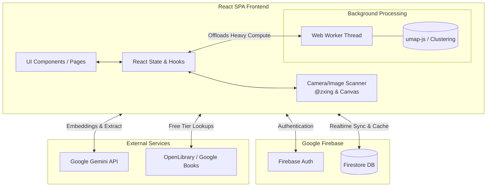

# Design Document: React Library & Book Tracking App (V2)

## Overview
The Library & Book Tracking App is a comprehensive digital system designed for readers, bibliophiles, and collectors to catalog both their physical and digital bookshelves. Built as a mostly-client Single Page Application (SPA), it goes beyond simple record-keeping by employing modern AI to intelligently enhance and analyze user data. Users can ingest books via barcode scanning, taking a picture of an physical bookshelves, or querying traditional book APIs. Once in the system, AI is used to backfill missing metadata, generate semantic embeddings for each book, and visually cluster the user's library into a spatial "Constellation Map."

## System Architecture Diagram



## Core Components & Capabilities

### 1. Library Dashboard & Book Management
The entry point provides an overview of all user libraries. We leverage heavily localized component state and context providers. To handle scale, queries against the `books` collection are **paginated and indexed**, avoiding massive memory footprints when a library exceeds a few hundred items.

### 2. Intelligent Ingestion Mechanisms
Inputting books through manual entry is a last resort. Primary flows include:
- **Barcode Scanning**: Client-side parsing of video feeds.
- **Spine/Bookshelf Scanning**: Taking a photo of a shelf, encoded as base64, and prompting an LLM to extract JSON arrays of titles and authors from the image.
- **Bulk CSV Import**: Drag-and-drop parsing of existing GoodReads CSVs.

### 3. Tiered "Spruce Up" Metadata Enrichment
Imported or scanned books often lack complete metadata. The `SpruceUpView` component batches deficient records. 
*   **Tier 1**: We query free, rate-limit-friendly APIs like OpenLibrary first.
*   **Tier 2**: For missing details or unstructured data (like summarizing a custom synopsis), we fallback to Gemini. This saves token cost and API quota.

### 4. Semantic Clustering (Constellation Map)
Each book is embedded as a 768-dimensional semantic vector based on its synopsis. We use UMAP (Uniform Manifold Approximation and Projection) to squash these vectors down to a 2D `[x,y]` coordinate, revealing stylistic or thematic groupings. This intensive math is offloaded to a Web Worker to prevent UI blocking.

## Architectural Choices & Tradeoffs

### 1. Frontend Framework: React 19 + Vite + SPA
- **Choice**: A purely client-rendered SPA.
- **Alternative**: SSR frameworks like Next.js.
- **Tradeoff**: We chose an SPA primarily because the app relies heavily on client device hardware (camera) and offline-first database synchronization (Firestore offline cache). SSR adds significant backend routing and state serialization complexity for zero benefit, since the data is highly personalized and behind an authentication wall (SEO is irrelevant).

### 2. Backend & Data Layer: Firebase Firestore (with Heavy Data Separation)
- **Choice**: Firebase Firestore, heavily normalizing data to separate UI state from heavy compute payloads.
- **Alternative**: Storing everything iteratively in one giant `Book` document.
- **Tradeoff**: Storing 768-float arrays (AI embeddings) and massive synopses inside the primary `Book` document destroys read performance and bandwidth for simple list queries. We strictly separate data into a lightweight `books` collection and a heavy `bookDetails` subcollection.

### 3. AI Processing: Direct Client-to-Gemini (Preview Phase)
- **Choice**: The `@google/genai` client SDK invokes Gemini directly from the browser.
- **Alternative**: A dedicated intermediate backend API / Cloud Function.
- **Tradeoff**: During development/preview, direct client calls drastically simplify the architecture. However, in a full production rollout, exposing API keys client-side is a severe anti-pattern. The architecture must evolve to proxy these calls through a Firebase Cloud Function using App Check to prevent token abuse.

### 4. Heavy Computation: Web Worker Threading
- **Choice**: Moving `umap-js` mathematically to a background Web Worker thread.
- **Alternative**: Running it on the main JavaScript thread handling the UI.
- **Tradeoff**: UMAP is an intensive $O(n \log n)$ algorithm. Client devices vary wildly in CPU power. Running this on the main thread guarantees UI jank or frozen screens for large libraries. Web Workers add a layer of async message-passing complexity, but are non-negotiable for preserving 60fps rendering during embedding projections.

## Data Model & Schema Definitions

To ensure snappy performance and low bandwidth egress, the database schema strictly isolates heavy text and ML arrays from the critical rendering path.

```typescript
interface Library {
  id: string;
  name: string;
  ownerId: string;
  sharedWith?: string[];     // Array of emails for shared access handling
  bookCount: number;         // Denormalized counter updated via Firestore increment()
  createdAt: Timestamp;
}

// ---------------------------------------------------------
// Fast-path: Sits on the primary read footprint.
// Extremely lightweight. List views load instantly.
// ---------------------------------------------------------
interface Book {
  id: string;
  title: string;
  author: string;
  coverUrl?: string;         
  status: 'to-read' | 'reading' | 'completed';
  rating?: number;
  addedAt: Timestamp;
}

// ---------------------------------------------------------
// Slow-path: Fetched ONLY when viewing a single book
// or when running background Constellation Map clustering.
// ---------------------------------------------------------
interface BookDetail {
  id: string;                // Matches parent Book ID
  synopsis?: string;
  authorBio?: string;
  genres: string[];          
  
  // Massive payload: 768-dimension vector
  embedding?: number[];      
  
  // Maintained separately; UMAP projection coords
  clusterCoordinates?: { x: number; y: number }; 
}
```

## Anti-Patterns Avoided

1. **The "God Query"**: We do not use `onSnapshot` to pull thousands of documents into memory. We paginate queries using composite indexes.
2. **Denial of Wallet**: We denormalize aggregation metrics like `bookCount` natively on the Library document using `increment(...)` counters. We deploy strict data integrity loops via Firebase rule tests to ensure counts never mismatch, and auto-migrate legacy documents missing these metrics.
3. **Redundant AI Processing**: We hash synopses. If a synopsis hasn't changed, we do not repeatedly request a new embedding from the Gemini API, saving API limits and time.
4. **Weak Security Boundaries**: Firebase Security Rules strictly isolate data. We use attribute-based access control on `library.data.ownerId` and `library.data.sharedWith` arrays to guarantee multi-tenant safety. Subcollections, like `bookDetails`, inherit zero-trust boundaries evaluated implicitly against the parent library document via `get(/databases/$(database)/documents/libraries/$(libraryId))`.
