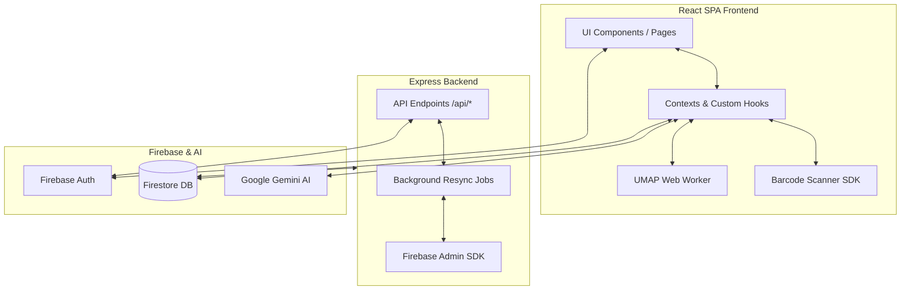

# Design Document: Bibliophile Hub (V2.1)

## Overview
Bibliophile Hub is a full-stack digital library management system designed to catalog, organize, and intelligently analyze book collections. Built with an **Express + Vite** hybrid architecture, it leverages **Google Gemini AI** for metadata extraction, semantic search, and spatial clustering. 

The application goes beyond a simple database by providing:
1.  **AI-Powered Ingestion**: Scanning physical bookshelves or barcodes to instantly extract book lists.
2.  **Semantic Constellation Map**: Visualizing the thematic relationships between books using high-dimensional embeddings projected into 2D space.
3.  **Tiered Metadata Enrichment**: A "Spruce Up" utility that combines free public APIs (OpenLibrary) with Gemini fallback for unstructured data.
4.  **Active Librarian Chatbot**: A persistent AI assistant that helps users query their collection and discover new titles.

---

## System Architecture

The application uses a **Full-Stack SPA** model. While the majority of the logic resides in the React frontend, an Express backend handles heavy background jobs and secure API proxying.

---

## Data Model & Schema

To maintain high performance even with large libraries (1,000+ books), we utilize a **Split-Collection Pattern** in Firestore. This ensures that the primary list views remain lightweight by isolating heavy text (synopses, embeddings) into a secondary subcollection.

### 1. `Library` (Collection: `/libraries`)
The root container for a user's collection.
- `id`: Unique ID.
- `name`: Library title.
- `ownerId`: UID of the creator.
- `sharedWith`: Array of emails for collaborative access.
- `bookCount`: Denormalized counter for quick UI stats.

### 2. `Book` (Collection: `/libraries/{id}/books`)
Fast-path data for list views and galleries.
- `title`, `author`, `isbn`.
- `coverUrl`: Optimized thumbnail reference.
- `genres`: Array of category tags.
- `userStatuses`: Map of user UIDs to their reading state (`reading`, `finished`, etc.).

### 3. `BookDetails` (Collection: `/libraries/{id}/bookDetails`)
Heavy-path data fetched on-demand for detail views or clustering.
- `synopsis`: Full book blurb.
- `authorBio`: AI-generated or fetched biography.
- `embedding`: 768-dimensional vector for thematic analysis.
- `clusterCoordinates`: `[x, y]` projection for the Constellation Map.

---

## Core Technical Features

### 1. The Constellation Map (UMAP Projection)
The most distinctive features of the app is the spatial visualization of a user's library.
- **Embeddings**: Gemini (text-embedding-004) generates vectors based on a combined string of Title + Author + Synopsis + Genres.
- **UMAP Worker**: The Uniform Manifold Approximation and Projection (UMAP) algorithm is executed in a **Web Worker thread** to avoid blocking the UI.
- **K-Means Clustering**: The projected 2D coordinates are grouped into "constellations."
- **AI Naming**: Gemini analyzes each cluster's member list to generate a poetic or descriptive name (e.g., "Nebula of Existentialist Fiction").

### 2. "Spruce Up" Utility (Data Cleaning)
A dedicated management view for resolving library issues:
- **Deduplication**: Fingerprinting logic detects likely duplicates based on ISBN or Title/Author overlaps.
- **Background Resync**: Users can trigger a "Force Resync" which offloads metadata backfilling to the Express server, preventing timeout issues on the client for large libraries.
- **Metadata Tiering**: The system prioritizes OpenLibrary API data, only using Gemini tokens for high-value enrichment (synopsis extraction/translation).

### 3. Librarian Chatbot
A persistent overlay that provides a conversational interface to the library.
- **Context Awareness**: Initialized with a summary of the current library's contents.
- **Multimodal capabilities**: Can answer questions about specific books, suggest "next reads" based on recent finishes, or explain why certain books are clustered together on the map.

---

## Architectural Tradeoffs & Decisions

### Why Express + Vite?
Initially built as a pure SPA, the need for robust background jobs (resyncing 500+ books) necessitated a server. Express provides a more reliable environment for long-running Firebase Admin operations that might otherwise be killed by browser tab suspension.

### Client-Side Embedding Generation vs Server-Side
Embeddings are generated directly from the client during map creation. This provides immediate visual feedback. However, the **Resync API** on the server is capable of clearing and regenerating these as part of a library-wide maintenance task to fix data drift.

### Recharts for Visualization
We chose `recharts` for the Constellation Map over low-level `d3` because it offers high-level React components that are easier to keep responsive. We bypass standard chart interactions to provide a custom, immersive constellation tooltip experience.

### Offline-First Experience
To minimize database egress costs and provide a snappy UI, the application utilizes **Firestore Persistent Local Cache** with multi-tab management. This allows the application to load the library instantly even if the user is in a low-connectivity environment, reconciling with the server only when changes are detected.

---

## Testing & Quality Assurance
The application maintains high testing standards using **Vitest** and **React Testing Library**.
- **Unit Testing**: 100% coverage of core business logic in services (`gemini`, `bookApi`).
- **Hook Testing**: Critical state management hooks like `useSelection` and `useAuth` are fully isolated and tested.
- **Component Integrity**: Complex UI components (e.g., `StarRating`, `ErrorBoundary`, `BookCard`) are verified for accessibility and state transitions.
- **Mock Safety**: We use robust Firebase mocks to simulate document snapshots and real-time listeners without making actual network requests during the CI/CD pipeline.

---

## Security & Access Control
- **Zero-Trust Rules**: Firestore Security Rules (enforced in `firestore.rules`) verify that the `request.auth.uid` matches the `ownerId` or is found in the `sharedWith` array of the parent library document before allowing any read/write on subcollections.
- **PII Isolation**: User emails are only stored in the `sharedWith` array and the `UserProfile` collection, never leaked into public book records.
